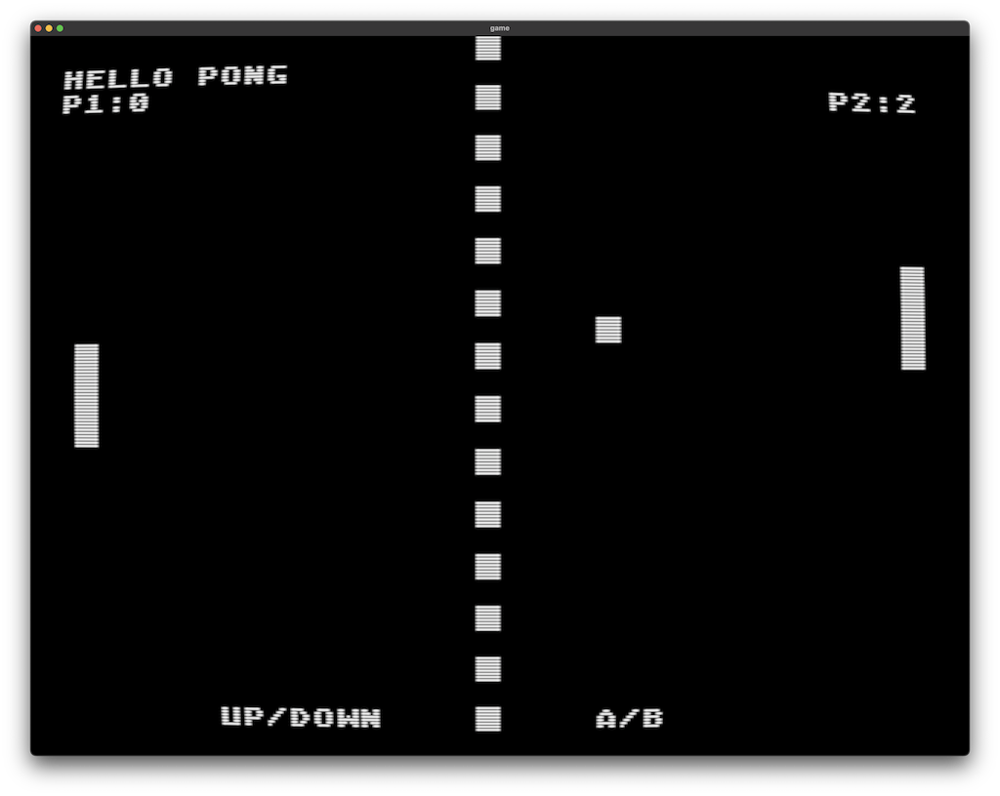
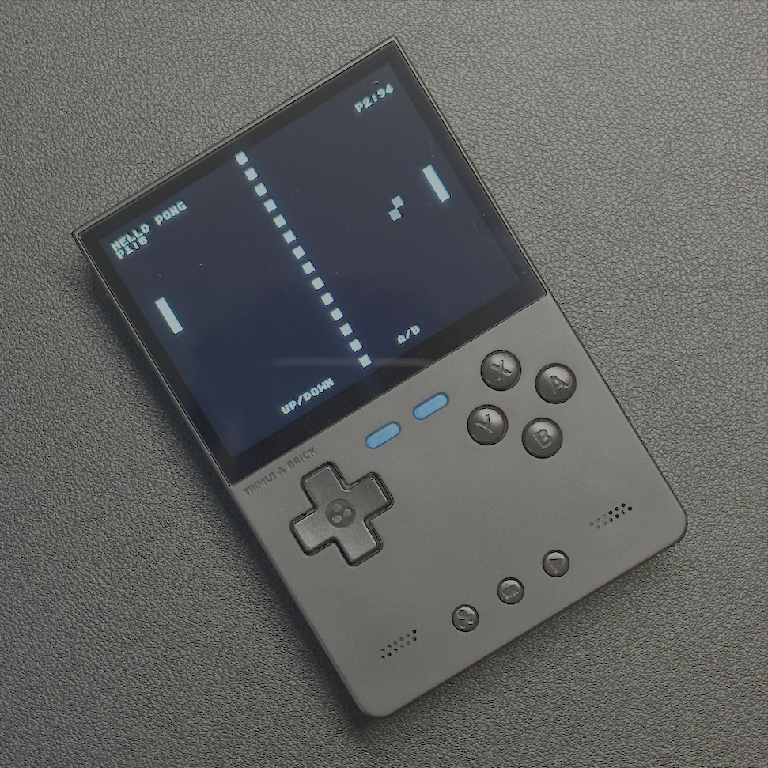

Please refer [SGDK](https://github.com/Stephane-D/SGDK) (Sega Genesis Development Kit) for more information about the development kit used in this project.

# Mega Drive - Hello Pong - Boilerplate
This is a simple Pong game for the Sega Mega Drive, demonstrating basic graphics and input handling.
It serves as a boilerplate for developing games on the Mega Drive platform.

<p align="center">
  
  <em>Running on OpenEmu using CRT Shader</em>
</p>

<p align="center">
  
  <em>Running on my TrimUI</em>
</p>

## Features
- Simple Pong game mechanics
- Basic graphics rendering
- Input handling for player controls
- Score tracking 

## Requirements
- Docker for building the project
- Sega Mega Drive emulator for testing

## Installation
To get started, clone the repository and remove the `.git` directory to start fresh with your own version control:
```bash
git clone https://github.com/marconvcm/mega_drive_dev.git
cd mega_drive_dev && rm -rf .git
```

## Building the Project
To build the project, run the following command in the terminal:
```bash
docker run --rm -v $PWD:/m68k -t registry.gitlab.com/doragasu/docker-sgdk:v2.00
```

## Running the Game
After building, you can run the game using a Sega Mega Drive emulator with file `out/rom.bin`. I would suggest to rename it to `game.md` for clarity.

```bash
mv out/rom.bin game.md
```

Just open the `game.md` file in your favorite Sega Mega Drive emulator.

## Contributing
Contributions are welcome! Please feel free to submit a pull request or open an issue if you find any bugs or have suggestions for improvements.

## License
This project is licensed under the MIT License. See the [LICENSE](LICENSE) file for details